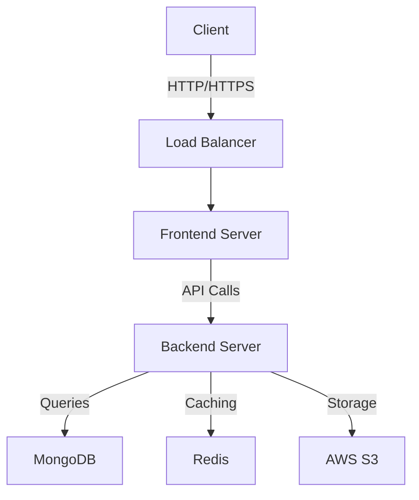

<div align="center">
  
# 🛍️ Canifa Fashion Store

[](https://reactjs.org/)
[](https://tailwindcss.com/)
[](https://nodejs.org/)
[](https://www.mongodb.com/)
[](https://expressjs.com/)

*Nền tảng thương mại điện tử thời trang hiện đại, an toàn và dễ sử dụng*

[Demo](https://canifa-store.vercel.app) | [Tài liệu API](./api-docs.md) | [Báo cáo Lỗi](https://github.com/your-username/canifa-store/issues)

</div>

## 📋 Mục lục

- [Tổng quan](#-tổng-quan)
- [Tính năng](#-tính-năng)
- [Công nghệ sử dụng](#-công-nghệ-sử-dụng)
- [Kiến trúc hệ thống](#-kiến-trúc-hệ-thống)
- [Cài đặt](#-cài-đặt)
- [Cấu hình](#-cấu-hình)
- [Hướng dẫn sử dụng](#-hướng-dẫn-sử-dụng)
- [API Documentation](#-api-documentation)
- [Đóng góp](#-đóng-góp)
- [Giấy phép](#-giấy-phép)

## 🎯 Tổng quan

Canifa Fashion Store là một nền tảng thương mại điện tử hiện đại, được xây dựng với mục tiêu mang đến trải nghiệm mua sắm trực tuyến tuyệt vời cho người dùng. Dự án tập trung vào việc tạo ra một giao diện thân thiện, dễ sử dụng, đồng thời đảm bảo hiệu suất và bảo mật cao.

### 🌟 Điểm nổi bật

- **Thiết kế Responsive**: Tương thích hoàn hảo trên mọi thiết bị
- **Hiệu suất cao**: Tối ưu hóa tải trang và rendering
- **Bảo mật**: Tuân thủ các tiêu chuẩn bảo mật hiện đại
- **SEO-friendly**: Tối ưu hóa cho công cụ tìm kiếm

## 🚀 Tính năng

### Người dùng cuối
- **🏠 Trang chủ**
  - Slider hiển thị bộ sưu tập mới
  - Sản phẩm nổi bật
  - Danh mục phổ biến
  - Flash sale và khuyến mãi

- **📱 Danh sách sản phẩm**
  - Lọc theo nhiều tiêu chí
  - Sắp xếp linh hoạt
  - Phân trang thông minh
  - Xem nhanh sản phẩm

- **🛍️ Chi tiết sản phẩm**
  - Hình ảnh chất lượng cao
  - Thông tin chi tiết sản phẩm
  - Đánh giá và bình luận
  - Sản phẩm liên quan

- **🛒 Giỏ hàng & Thanh toán**
  - Quản lý giỏ hàng trực quan
  - Nhiều phương thức thanh toán
  - Tích hợp vận chuyển
  - Mã giảm giá

### Quản trị viên
- **📊 Dashboard**
  - Thống kê doanh số
  - Quản lý đơn hàng
  - Báo cáo người dùng
  - Phân tích xu hướng

## 🛠 Công nghệ sử dụng

### Frontend
```
├── React (Framework chính)
├── Tailwind CSS (Styling)
├── Redux Toolkit (Quản lý state)
├── React Router (Routing)
├── Axios (HTTP Client)
└── React Query (Data Fetching)
```

### Backend
```
├── Node.js (Runtime)
├── Express.js (Web Framework)
├── MongoDB (Database)
├── Mongoose (ODM)
└── JWT (Authentication)
```

### DevOps & Tools
```
├── Docker (Containerization)
├── GitHub Actions (CI/CD)
├── ESLint (Linting)
├── Jest (Testing)
└── Prettier (Code Formatting)
```

## 🏗 Kiến trúc hệ thống



## ⚙️ Cài đặt

### Yêu cầu hệ thống
- Node.js (>= 14.x)
- npm hoặc yarn
- MongoDB (>= 4.x)
- Git

### Các bước cài đặt

1. **Clone repository**
```bash
git clone https://github.com/your-username/canifa-store.git
cd canifa-store
```

2. **Cài đặt dependencies cho Frontend**
```bash
cd frontend
npm install
```

3. **Cài đặt dependencies cho Backend**
```bash
cd backend
npm install
```

4. **Cấu hình môi trường**
```bash
cp .env.example .env
# Cập nhật các biến môi trường trong file .env
```

5. **Khởi chạy ứng dụng**
```bash
# Terminal 1 - Frontend
cd frontend
npm run dev

# Terminal 2 - Backend
cd backend
npm run dev
```

## ⚡️ Cấu hình

### Biến môi trường

```env
# Frontend
VITE_API_URL=http://localhost:5000
VITE_GOOGLE_MAPS_API_KEY=your_google_maps_api_key

# Backend
PORT=5000
MONGODB_URI=mongodb://localhost:27017/canifa
JWT_SECRET=your_jwt_secret
AWS_ACCESS_KEY_ID=your_aws_access_key
AWS_SECRET_ACCESS_KEY=your_aws_secret_key
```

## 📖 Hướng dẫn sử dụng

### Dành cho người dùng

1. **Đăng ký tài khoản**
   - Truy cập trang đăng ký
   - Điền thông tin cá nhân
   - Xác thực email

2. **Mua sắm**
   - Duyệt sản phẩm theo danh mục
   - Thêm vào giỏ hàng
   - Tiến hành thanh toán

### Dành cho quản trị viên

1. **Quản lý sản phẩm**
   - Thêm/sửa/xóa sản phẩm
   - Quản lý kho hàng
   - Cập nhật giá

2. **Quản lý đơn hàng**
   - Xử lý đơn hàng mới
   - Cập nhật trạng thái
   - Xuất báo cáo

## 📚 API Documentation

API documentation được tạo tự động bằng Swagger UI và có thể truy cập tại:
```
http://localhost:5000/api-docs
```

### Ví dụ API Endpoints

```javascript
// Products
GET /api/products
GET /api/products/:id
POST /api/products
PUT /api/products/:id
DELETE /api/products/:id

// Auth
POST /api/auth/register
POST /api/auth/login
POST /api/auth/refresh-token

// Orders
GET /api/orders
POST /api/orders
PUT /api/orders/:id
```

## 🤝 Đóng góp

Chúng tôi rất hoan nghênh mọi đóng góp từ cộng đồng! Nếu bạn muốn đóng góp:

1. Fork repository
2. Tạo branch mới (`git checkout -b feature/AmazingFeature`)
3. Commit changes (`git commit -m 'Add some AmazingFeature'`)
4. Push to branch (`git push origin feature/AmazingFeature`)
5. Mở Pull Request

## 📄 Giấy phép

Dự án được phát hành dưới giấy phép MIT. Xem file [LICENSE](./LICENSE) để biết thêm chi tiết.

---

<div align="center">

Made with ❤️ by [Your Team Name](https://your-website.com)

</div>